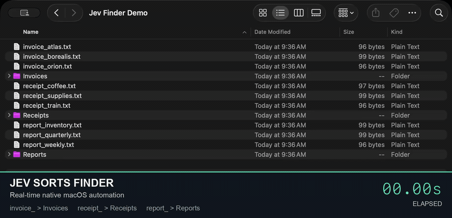

# Jev macOS Loop: Native AI Computer Use & GUI Automation



**Real Finder demo: 9 files → 3 folders in 22.69 seconds, independently verified.** [Watch the full-resolution MP4](docs/media/jev-finder-demo.mp4) · [Recording details](docs/recording.md)

Jev macOS Loop is an open-source computer-use agent for **native macOS GUI automation on Apple silicon**. It combines **OmniParser CoreML**, **Apple Vision OCR**, and **macOS accessibility** to identify controls locally, then uses **Jev** to select the next action. Bring your own token for **Vercel AI Gateway**, **OpenRouter**, or **TypesafeAI**.

[](https://github.com/jcpsimmons/jev-macos-loop/actions/workflows/checks.yml)
[](LICENSE)
[](#installation)

[Install](#installation) · [Configure your token](#bring-your-own-token) · [Run an automation](#run-native-macos-automation) · [Benchmarks](#verified-performance) · [Architecture](docs/architecture.md)

## Set up with your agent

**Copy and paste this into your agent:**

```text
Read https://raw.githubusercontent.com/jcpsimmons/jev-macos-loop/master/AGENTS.md
and follow its instructions to install, configure, verify, and integrate Jev
macOS Loop with my agent. Reuse an existing installation or token configuration
where available. Complete the setup and disposable-app test, then make it
available for future native Mac tasks. Ask me only for missing information,
credentials through a secure local workflow, or permissions you actually need.
```

Works through local terminal tools in Claude Code, Codex, Grok, Cursor, Gemini CLI, Copilot, and other coding agents. [AGENTS.md](AGENTS.md) has the full workflow. Requires a local Apple silicon Mac; the guide handles prerequisites, provider tokens, and macOS permissions.

## Native computer use with local perception

- **Native Mac applications:** interact with visible controls through guarded mouse clicks; the Finder demo also supports scoped file drags, without a browser DOM.
- **Local computer vision:** ScreenCaptureKit, OmniParser CoreML, Apple Vision OCR, and accessibility labels identify the selected window's controls.
- **Text-only Jev decisions:** screenshots, pixels, and coordinates stay on the Mac. Only observed text, the goal, and finite choices go to your selected provider.
- **Three provider routes:** use your own Vercel AI Gateway, OpenRouter, or TypesafeAI console token.
- **Guarded input:** check focus, window position, occlusion, fresh frames, confidence, and live accessibility state before input.
- **Independent verification:** the included native-app benchmarks check the actual result separately from Jev's DONE decision.

The demo uses **real Finder**, nine fictional text files, and three empty folders. Jev reads each filename and chooses its destination; native mouse drags move the files. A separate verifier checks all nine locations and content hashes. Screen Studio captures only the Finder window, with no camera or audio. The elapsed timer is added from measured run timestamps; the entire timed task plays at normal speed without cuts.

## Installation

Requires **Apple silicon, macOS 14.2+, Xcode Command Line Tools, Node.js 22+, and `uv`** for one-time model conversion.

```sh
git clone https://github.com/jcpsimmons/jev-macos-loop.git
cd jev-macos-loop
npm ci
uv venv --python 3.12
uv pip install --python .venv/bin/python -r scripts/model-requirements.txt
.venv/bin/python scripts/export_model.py
npm run build
```

The setup downloads a pinned OmniParser detector, verifies its SHA-256, and converts it to CoreML. Model weights, credentials, and local captures are ignored by Git.

## Bring your own token

Copy `.env.example` to `.env.local`, select `JEV_PROVIDER`, and add your token. To use an existing env file without modifying it, set `JEV_ENV_FILE=/path/to/your/.env.local`.

| `JEV_PROVIDER`     | Your token variable  | Default model          | Get a token                                                     |
| ------------------ | -------------------- | ---------------------- | --------------------------------------------------------------- |
| `vercel` (default) | `AI_GATEWAY_API_KEY` | `typesafe-ai/jev`      | [Vercel AI Gateway](https://vercel.com/ai-gateway)              |
| `openrouter`       | `OPENROUTER_API_KEY` | `~typesafe/jev-latest` | [OpenRouter keys](https://openrouter.ai/settings/keys)          |
| `typesafe`         | `TYPESAFE_API_KEY`   | `jev-latest`           | [TypesafeAI console](https://console.typesafe.ai/settings/keys) |

`JEV_MODEL` optionally overrides the model ID. Vercel also supports `VERCEL_OIDC_TOKEN`. A missing or rejected token stops the run; the runner never silently switches providers. Tokens go only to the selected service and are excluded from traces.

```sh
JEV_PROVIDER=openrouter npm run check:provider
# Or select vercel / typesafe with the corresponding token configured.
```

The provider check sends three small decision requests without accessing the screen. Vercel and OpenRouter have passed live checks; the direct TypesafeAI adapter has offline contract tests and still needs verification with your console token. See [provider setup and verification](docs/providers.md).

## Run native macOS automation

```sh
npm start -- --doctor
npm start -- --windows
npm start -- --window 123 --goal 'Open the project settings' --fast-ocr
```

Replace `123` with the window ID from `--windows`. Enable Screen Recording and Accessibility for your terminal application if `--doctor` reports they are missing. The runner brings the selected window forward once, observes its controls, asks Jev for a choice, validates the action, clicks, and observes again. Ctrl+C stops it.

`--fast-ocr` reduces perception time for apps with good accessibility labels. Omit it for accurate OCR, or use `--no-ax` to test local computer vision without accessibility labels.

## Try the Finder file-sorting demo

```sh
npm run demo:finder -- --prepare
# Open the printed root in Finder; use list view, sort by Name, collapse folders.
npm run demo:finder -- --manifest /absolute/path/printed/above/manifest.json
```

The first command creates a fresh temporary folder with nine dummy files and three empty destinations. The second warms up and waits for Enter, then Jev sorts `invoice_`, `receipt_`, and `report_` files into **Invoices**, **Receipts**, and **Reports**. Add `--now` to start immediately. Keep the Finder window visible and leave input idle. The final JSON must say `passed: true`; a failed or uncertain move stops the run. This experimental harness is restricted to its disposable setup. [Recording and verification details](docs/recording.md).

## Verified performance

**6/6 native GUI tasks passed on Vercel and 6/6 on OpenRouter**, with separate Apple Calculator checks. Each suite includes settings changes and project navigation, varying button positions and testing with and without accessibility labels.

| Measurement                          | Vercel AI Gateway |  OpenRouter |
| ------------------------------------ | ----------------: | ----------: |
| Native GUI tasks passed              |               6/6 |         6/6 |
| Median Jev decision round-trip       |          301.9 ms |    293.5 ms |
| Median full observe–decide–act cycle |          394.6 ms |    367.2 ms |
| Task completion range                |       1.02–2.26 s | 0.90–2.49 s |

The Finder demo completed in **22.69 s** through Vercel, including deliberate waits for Finder to settle after each drag. The earlier settings demo completed in **2.14 s**. These are small functional samples with model warmup excluded, not broad reliability evidence or a controlled provider comparison. [Read the benchmark methodology, raw traces, and failures](docs/performance.md).

```sh
npm test                                  # offline, no API calls
npm run benchmark -- --suite --fast-ocr    # six native GUI tasks with live Jev calls
node scripts/calculator.mjs 32 14          # open Calculator in Basic mode first
npm run record:demo                       # disposable app with a live stopwatch
```

Each benchmark launches a disposable native app. A separate result log verifies the final state; the decision policy cannot read it. Calculator has its own independent display reader. Local artifacts stay in `artifacts/`. See [how to record a timed demo](docs/recording.md#record-the-finder-demo-yourself).

## How the macOS computer-use loop works

**Capture → detect controls → read text → Jev chooses → validate → act → observe again.**

One persistent Swift process loads CoreML once and streams window frames through ScreenCaptureKit. OmniParser and OCR run concurrently. Accessibility adds current labels, values, and bounds; conflicting OCR in those regions is resolved locally. Jev receives a finite-choice question over the observed element IDs. Coordinates and input remain local.

| File                      | Purpose                                                              |
| ------------------------- | -------------------------------------------------------------------- |
| `native/Perception.swift` | Window capture, CoreML, OCR, accessibility fusion, and guarded input |
| `src/decide.mjs`          | Text-only Jev payload and finite-choice policy                       |
| `src/providers.mjs`       | Vercel AI Gateway, OpenRouter, and TypesafeAI adapters               |
| `src/loop.mjs`            | Observe–decide–act loop and execution limits                         |
| `scripts/benchmark.mjs`   | Live native-app suite with independent outcome checks                |
| `src/finder.mjs`          | Finite-choice Finder sorting policy and guarded drag loop            |
| `scripts/finder-demo.mjs` | Disposable Finder setup and independent file verification            |
| `scripts/record-demo.mjs` | Timed settings recording harness                                     |

[Read the architecture and dependency details](docs/architecture.md).

## Frequently asked questions

### Does it send screenshots to an AI model?

No. Pixels, detector boxes, and click coordinates stay on the Mac. Observed screen text, accessibility labels, the task goal, and recent actions are sent to your chosen Jev provider. Local perception does not make the entire system offline.

### Does it use a generative LLM or browser automation?

The loop uses Jev's structured decision API rather than chat completions or generated code. It controls native macOS windows without a browser DOM. It does not generate typed text or plan arbitrary long workflows.

### Which Macs and applications are supported?

The current build targets Apple silicon on macOS 14.2 or later. It handles clicks within one selected window. Apps with accessible controls work best; icon-only controls and OCR-only state can be ambiguous. The separate Finder harness adds file-to-folder drags inside its disposable directory. General drags, free-form typing, and multi-window workflows are outside the current scope.

### Can I use my own OpenRouter, Vercel, or TypesafeAI token?

Yes. Set `JEV_PROVIDER` and the matching token in `.env.local`. All three routes share the same input policy and validation. [Provider instructions](docs/providers.md) include endpoint details and live-test status.

### Does DONE prove the task succeeded?

DONE is a model decision. The supplied benchmarks independently check the native app's actual state before reporting success. Arbitrary applications need their own outcome checks.

## License

[AGPL-3.0](LICENSE). The Ultralytics-based OmniParser detector retains its upstream license. Model weights are downloaded during setup and are not committed. [Dependency references](docs/architecture.md#models-and-dependencies) identify the pinned detector and libraries.
